# DrukSave — Entity Relationship Diagram

Matches `packages/database/prisma/schema.prisma`. Auth/identity entities
(top box) carry business logic in Phase 1; money-domain and
intelligence/ops entities exist in the schema now for forward-compatibility
but are unused until their respective phases.

Note: the PRD's "Income" and "Expenses" tables are modeled as a single
`Transaction` table with a `type` discriminator (`INCOME` | `EXPENSE`) — the
standard normalized approach for a ledger — rather than two parallel tables.

```mermaid
erDiagram
    USER ||--o| PROFILE : has
    USER ||--o{ DEVICE : registers
    USER ||--o{ SESSION : opens
    USER ||--o{ AUDIT_LOG : generates
    USER ||--o| SETTING : configures
    USER ||--o{ TRANSACTION : records
    USER ||--o{ CATEGORY : customizes
    USER ||--o{ RECURRING_TRANSACTION : schedules
    USER ||--o{ BUDGET : sets
    USER ||--o{ GOAL : pursues
    USER ||--o{ RECEIPT : uploads
    USER ||--o{ ANALYTICS : accrues
    USER ||--o{ INSIGHT : receives
    USER ||--o{ AI_PREDICTION : receives
    USER ||--o{ NOTIFICATION : receives
    USER ||--o{ REPORT : generates

    DEVICE ||--o{ SESSION : authorizes

    CATEGORY ||--o{ TRANSACTION : classifies
    MERCHANT ||--o{ TRANSACTION : involved_in
    RECURRING_TRANSACTION ||--o{ TRANSACTION : generates
    RECEIPT ||--o| TRANSACTION : attached_to
    RECEIPT ||--o{ ATTACHMENT : contains
    REPORT ||--o{ ATTACHMENT : contains

    GOAL ||--o{ GOAL_CONTRIBUTION : accumulates
    CATEGORY ||--o{ BUDGET : limits
    CATEGORY ||--o{ RECURRING_TRANSACTION : classifies

    USER {
        uuid id PK
        string email UK
        string passwordHash
        Role role
        boolean isActive
        int failedLoginCount
        datetime lockedUntil
        datetime lastLoginAt
    }

    PROFILE {
        uuid id PK
        uuid userId FK
        string fullName
        string phone UK
        string dzongkhag
        string occupation
        string avatarUrl
    }

    DEVICE {
        uuid id PK
        uuid userId FK
        string deviceId
        string platform
        datetime lastSeenAt
    }

    SESSION {
        uuid id PK
        uuid userId FK
        uuid deviceId FK
        string refreshTokenHash
        datetime expiresAt
        datetime revokedAt
    }

    AUDIT_LOG {
        uuid id PK
        uuid userId FK
        string action
        json metadata
        string ip
        datetime createdAt
    }

    TRANSACTION {
        uuid id PK
        uuid userId FK
        TransactionType type
        decimal amountNu
        uuid categoryId FK
        uuid merchantId FK
        datetime occurredAt
    }

    CATEGORY {
        uuid id PK
        uuid userId FK
        string name
        TransactionType type
        boolean isSystem
    }

    MERCHANT {
        uuid id PK
        string name
        string normalizedName UK
    }

    RECURRING_TRANSACTION {
        uuid id PK
        uuid userId FK
        TransactionType type
        decimal amountNu
        RecurrenceFrequency frequency
        datetime nextRunAt
    }

    BUDGET {
        uuid id PK
        uuid userId FK
        uuid categoryId FK
        BudgetPeriod period
        decimal limitNu
    }

    GOAL {
        uuid id PK
        uuid userId FK
        string name
        decimal targetAmountNu
        decimal savedAmountNu
        GoalStatus status
    }

    GOAL_CONTRIBUTION {
        uuid id PK
        uuid goalId FK
        decimal amountNu
        datetime contributedAt
    }

    RECEIPT {
        uuid id PK
        uuid userId FK
        string imageUrl
        string ocrRawText
        decimal ocrAmountNu
    }

    ATTACHMENT {
        uuid id PK
        uuid receiptId FK
        uuid reportId FK
        string fileUrl
    }

    ANALYTICS {
        uuid id PK
        uuid userId FK
        datetime periodStart
        decimal totalIncomeNu
        decimal totalExpenseNu
        int healthScore
    }

    INSIGHT {
        uuid id PK
        uuid userId FK
        InsightType type
        string title
        string body
    }

    AI_PREDICTION {
        uuid id PK
        uuid userId FK
        PredictionType type
        json payload
        float confidence
    }

    NOTIFICATION {
        uuid id PK
        uuid userId FK
        NotificationChannel channel
        NotificationStatus status
    }

    REPORT {
        uuid id PK
        uuid userId FK
        ReportType type
        ReportFormat format
        string fileUrl
    }

    SETTING {
        uuid id PK
        uuid userId FK
        string language
        string theme
        string currency
    }
```

